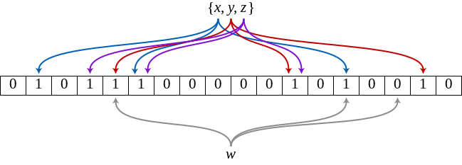

# Your basic int

### The ultimate underrated data type

*Unicode Character 'DOUBLE-STRUCK CAPITAL Z' (U+2124)*

# Introduction

Every kid knows what an [integer number][integer] is,
and every programmer is familiar with the [int data type][int].  
Still we frequently forget how powerful an integer can be.

- **Generic**  
  An `int` or `int[]` is a bit pattern that can represent anything.  
  Furthermore, an `int` can point into an array containing any type of data.  
  That's as generic as it gets.

- **Effective**  
  With an `int` you have all of basic mathematics at your finger tips;  
  and boolean algebra, implemented with bit-level parallelism, to boot.

- **Efficient**  
  An `int` fits inside a register sitting on the main datapath of the CPU,  
  and an `int[]` is the main focus of hardware memory optimization.  
  It doesn't get much faster or more efficient than that.

- **Simple**  
  Not really, but we've used arithmetic since childhood so it feels that way.  
  Familiarity breeds both simplicity and contempt.

The code examples are in [Go][golang] and the text comes with
three example libraries:

- [bit][bit] contains a set data structure and some bit-twiddling functions,
- [bloom][bloom] is a Bloom filter, a probabilistic set data structure, and
- [graph][graph] is a library of basic graph algorithms.

Unless otherwise stated, an **integer** indicates an integral data type
consisting of 32 or 64 bits.

# Generic vertex labeling

Don't reach for parametric polymorphism or complicated type hierarchies
when an integer does a better job.

From the [github.com/yourbasic/graph][graph] package:

    All algorithms operate on directed graphs with a fixed number of vertices, 
    labeled from 0 to n-1, and edges with integer cost.

Since vertices are represented by integers, it's easy to add vertex data
on the side. For example, this implementation of breadth-first search
uses an array of booleans to keep track of which vertices have been visited.

    // BFS traverses g in breadth-first order starting at v.
    // When the algorithm follows an edge (v, w) and finds a previously
    // unvisited vertex w, it calls do(v, w, c) with c equal to
    // the cost of the edge (v, w).
    func BFS(g Iterator, v int, do func(v, w int, c int64)) {
        visited := make([]bool, g.Order())
        visited[v] = true
        for queue := []int{v}; len(queue) > 0; {
            v := queue[0]
            queue = queue[1:]
            g.Visit(v, func(w int, c int64) (skip bool) {
                if visited[w] {
                    return
                }
                do(v, w, c)
                visited[w] = true
                queue = append(queue, w)
                return
            })
        }
    }

*From [bfs.go][graphbfs].*

# Bit-twiddling

Bitwise operators...

Code sample from the [github.com/yourbasic/bit][bit] package:

    // Count returns the number of nonzero bits in w.
    func Count(w uint64) int {
        // “Software Optimization Guide for AMD64 Processors”, Section 8.6.
        const maxw = 1<<64 - 1
        const bpw = 64
    
        // Compute the count for each 2-bit group.
        // Example using 16-bit word w = 00,01,10,11,00,01,10,11
        // w - (w>>1) & 01,01,01,01,01,01,01,01 = 00,01,01,10,00,01,01,10
        w -= (w >> 1) & (maxw / 3)

        // Add the count of adjacent 2-bit groups and store in 4-bit groups:
        // w & 0011,0011,0011,0011 + w>>2 & 0011,0011,0011,0011 = 0001,0011,0001,0011
        w = w&(maxw/15*3) + (w>>2)&(maxw/15*3)
    
        // Add the count of adjacent 4-bit groups and store in 8-bit groups:
        // (w + w>>4) & 00001111,00001111 = 00000100,00000100
        w += w >> 4
        w &= maxw / 255 * 15
    
        // Add all 8-bit counts with a multiplication and a shift:
        // (w * 00000001,00000001) >> 8 = 00001000
        w *= maxw / 255
        w >>= (bpw/8 - 1) * 8
        return int(w)
    }

*From [funcs.go][bitfunc].*

# Bit set

A bit set, or bit array, is an efficient set data structure that consists
of an array of bits. Because it uses bit-level parallelism,
limits memory access, and efficiently uses the data cache,
a bit set often outperforms other data structures.

Create the set of all primes less than *n* in O(*n* log log *n*) time.
Try the code with *n* equal to a few hundred millions and be pleasantly surprised.

    // Sieve of Eratosthenes
    sieve := bit.New().AddRange(2, n)
    sqrtN := int(math.Sqrt(n))
    for p := 2; p <= sqrtN; p = sieve.Next(p) {
        for k := p * p; k < n; k += p {
            sieve.Delete(k)
        }
    }

*From [godoc.org/github.com/yourbasic/bit][bitdoc].*

# Bloom filter

A Bloom filter is a fast and space-efficient probabilistic data structure
used to test set membership.

A membership test returns either ”likely member” or ”definitely not a member”.
Only false positives can occur: an element that has been added to the filter
will always be identified as ”likely member”.

The probabilities of different outcomes of a membership test
at a false-positives rate of 1/100 are:

    Test(s)                 true     falsee
    --------------------------------------
    s has been added        1        0
    s has not been added    0.01     0.99

Elements can be added, but not removed. With more elements in the filter,
the probability of false positives increases.

### Implementation

*An example of a Bloom filter that  consists of 18 bits and uses 3 hash functions.  
The colored arrows point to the bits that the elements of the set {x, y, z} are mapped to.  
The element w is not in the set, because it hashes to a bit position containing 0.*

#### Stefan Nilsson — [korthaj][korthaj]

*This work is licensed under a [Creative Commons Attribution 3.0 Unported License][CCBY3].*

[bit]: https://github.com/yourbasic/bit
[bitdoc]: https://godoc.org/github.com/yourbasic/bit
[bitfunc]: https://github.com/yourbasic/bit/blob/master/funcs.go
[bloom]: https://github.com/yourbasic/bloom
[CCBY3]: https://creativecommons.org/licenses/by/3.0/deed.en
[golang]: https://golang.org
[graph]: https://github.com/yourbasic/graph
[graphbfs]: https://github.com/yourbasic/graph/blob/master/bfs.go
[int]: https://en.wikipedia.org/wiki/Integer_(computer_science)
[integer]: https://en.wikipedia.org/wiki/Integer
[korthaj]: https://github.com/korthaj
[wikibloom]: https://en.wikipedia.org/wiki/File:Bloom_filter.svg
[wikiint]: (https://commons.wikimedia.org/wiki/File:Integers-line.svg)

